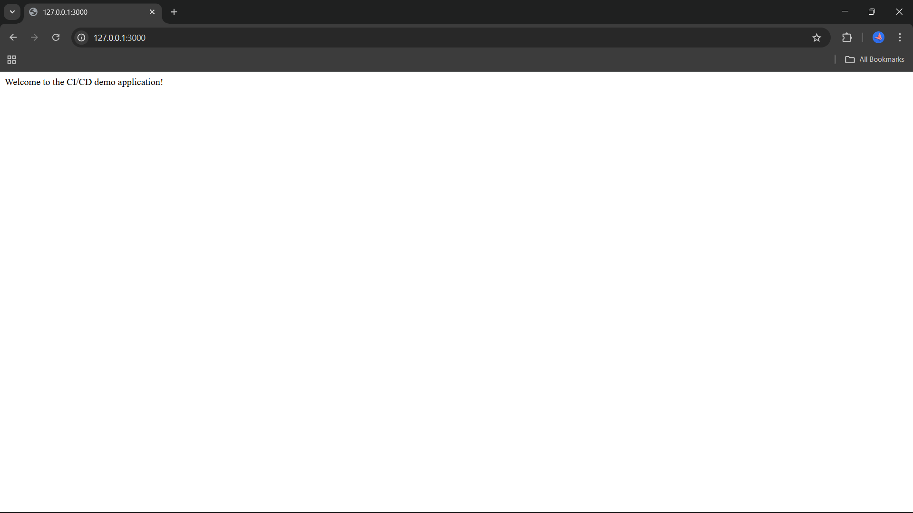

# Node.js Demo App with CI/CD Pipeline

The project demonstrates a complete CI/CD automation workflow using GitHub Actions for a sample Node.js web application. The pipeline automatically installs dependencies, builds a Docker image, and pushes it to DockerHub whenever code is pushed to the main branch.
## Features

- Node.js web application (app.js)

- Dockerized application for consistent environments

- Automated CI/CD pipeline using GitHub Actions

- Docker image automatically built and pushed to DockerHub

- Triggers pipeline on every push to main branch

- Easy setup with npm install and npm start

## Installation

Follow these steps to set up the project locally:

1. Clone the repository:
```bash
git clone https://github.com/Nishika10/nodejs-demo-app.git
cd nodejs-demo-app
```
2. Install dependencies:
```bash
npm install
```
This sets up all the required Node.js packages for the project.

## Usage / Examples

Once installation is complete, you can run the application:

1. Run locally with Node.js:
```bash
npm start
```

- Open your browser and go to: http://localhost:3000


2. Run with Docker:
```bash
docker build -t demo-app .
docker run -p 3000:3000 demo-app
```

- Open your browser and go to: http://localhost:3000


## Tech / Tools Used


- **Node.js** – JavaScript runtime for building the web application

- **npm** – Node.js package manager for dependencies

- **Docker** – Containerization for consistent environments

- **GitHub Actions** – CI/CD workflow automation

- **DockerHub** – Docker image hosting and deployment

## CI/CD Workflow

- Whenever code is pushed to main, GitHub Actions automatically:

- Checks out the repo on a virtual Ubuntu machine.

- Sets up Node.js and installs dependencies.

- Runs tests.

- Builds a Docker image of the app.

- Pushes the Docker image to DockerHub.

This automates building, testing, and deploying your app.
##  Screenshot/Web Page

Here are some screenshots of the Node.js Demo App running:




